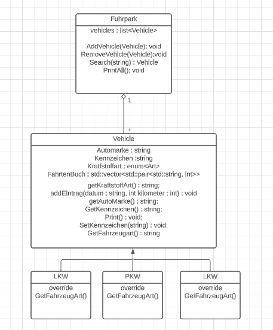

# System Dokumentation Fuhrpark

## Organisatorisches
### Teammitglieder:
*   Paul Engelhardt
### Geschätzer Arbeitsaufwand
10 Stunden

## Anforderungen

Der Fuhrpark muss die möglichkeit besitzen verschiedene Arten von Fahrzeugen verwalten zu können.

Desweiteren ist es wichtig das Der Fuhrpark zuweißbar/kopierbar ist

Um Verschiedene Arten von Fahrzeugen speichern zu können wird Vererbung verwendet, mit einer Fahrzeugbasisklasse.

Fahrzeuge selber müssen allgemeine Informationen über die Fahrzeuge speicher können, sowie als Liste ein Fahrtenbuch.
Um Das Datum bei einem Fahrtenbuch zu speichern wurde ein String verwendet anstatt ein eigener Datentyp um es einfach zu halten


Des weiteren wird für das Fahrtenbuch kein eigener Datentyp verwendet sonder eine Vector liste eines pairs.


## Systementwurf



## KomponentenEntwurf

Siehe Doxygen für KomponentenEntwurf

## Doxygen

Siehe Ordner DoxygenGen


## TestProtokollierung:

Die Tests befinden sich in Main.cpp

Der Folgende Screenshot zeigt den testoutput.


## Sourcode 


``` cpp

/* File: Fahrzeug.hpp
*  Creator: Paul Engelhardt
*/

#pragma once

#include <iostream>
#include <fstream>
#include <vector>
#include <string>
#include <algorithm>


/// <summary>
/// Fahrzeug klasse
/// Basis klasse für alle Fahrzeuge
/// </summary>
class Fahrzeug {
public:
    /// <summary>
    /// Fahrzeug konstruktor
    /// </summary>
    /// <param name="marke"></param>
    /// <param name="kennzeichen"></param>
    /// <param name="kraftstoffart"></param>
    Fahrzeug(const std::string& marke, const std::string& kennzeichen, const std::string& kraftstoffart);

    /// <summary>
    /// füge neuen EIntrag zu fahrtenbuch hinzu
    /// </summary>
    /// <param name="datum"></param>
    /// <param name="kilometer"></param>
    void AddEintrag(const std::string& datum, int kilometer);


    /// <summary>
    /// GetMarke
    /// </summary>
    /// <returns></returns>
    const std::string& GetMarke() const;
    /// <summary>
    /// GetKennzeichen
    /// </summary>
    /// <returns></returns>
    const std::string& GetKennzeichen() const;
    /// <summary>
    /// Get Kraftstoffart
    /// </summary>
    /// <returns></returns>
    const std::string& GetKraftstoffart() const;

    /// <summary>
    /// GetFahrtenbuch
    /// </summary>
    /// <returns></returns>
    const std::vector<std::pair<std::string, int>>& GetFahrtenbuch() const;

    /// <summary>
    /// GetGesamtKilomter
    /// </summary>
    /// <returns></returns>
    int GetKM() const;

    /// <summary>
    /// Print the vehicle
    /// </summary>
    void Print() const;


    /// <summary>
    /// Get type of vehicle (override later)
    /// </summary>
    /// <returns></returns>
    virtual std::string GetVehicleType() const;

private:
    std::string marke;
    std::string kennzeichen;
    std::string kraftstoffart;
    std::vector<std::pair<std::string, int>> fahrtenbuch;
};
```


```cpp
/* File: Fuhrpark.hpp
*  Creator: Paul Engelhardt
*/

#pragma once

#include "Fahrzeug.hpp"
#include "PKW.hpp"
#include "LKW.hpp"
#include "Motorrad.hpp"
#include "Fuhrpark.hpp"

/// <summary>
/// Fuhrpark klasse
/// </summary>
class Fuhrpark {
public:
    Fuhrpark() = default;


    Fuhrpark(const Fuhrpark& other);

    Fuhrpark& operator=(const Fuhrpark& other);

    /// <summary>
    /// Füge ein neues Fahrzeug hinzu
    /// </summary>
    /// <param name="fahrzeug"></param>
    void AddVehicle(Fahrzeug* fahrzeug);


    /// <summary>
    /// Removes a vehicle by number plate 
    /// </summary>
    /// <param name="kennzeichen"></param>
    bool RemoveVehicle(const std::string& kennzeichen);


    /// <summary>
    /// Search for vehicle by numberplate
    /// </summary>
    /// <param name="kennzeichen"></param>
    /// <returns></returns>
    Fahrzeug* Search(const std::string& kennzeichen);


    /// <summary>
    /// Print all vehicles
    /// </summary>
    /// <param name="os"></param>
    void PrintAll(std::ostream& os) const;


    /// <summary>
    /// print all vehicles to file
    /// </summary>
    /// <param name="dateiName"></param>
    void OutToFile(const std::string& dateiName) const;


    /// <summary>
    /// Get total 
    /// </summary>
    /// <returns></returns>
    int GesamtKM() const;

private:
    std::vector<Fahrzeug*> fahrzeuge_;
};
```

```cpp
/* File: LKW.hpp
*  Creator: Paul Engelhardt
*/
#pragma once

#include "Fahrzeug.hpp"


/// <summary>
/// LKW, child of Fahrzeug
/// </summary>
class LKW : public Fahrzeug {
public:
    /// <summary>
    /// Construktor
    /// </summary>
    /// <param name="marke"></param>
    /// <param name="kennzeichen"></param>
    /// <param name="kraftstoffart"></param>
    LKW(const std::string& marke, const std::string& kennzeichen, const std::string& kraftstoffart);

    /// <summary>
    /// lkw specific vehicletype
    /// </summary>
    /// <returns></returns>
    virtual std::string GetVehicleType() const override;
};
```

```cpp
/* File: Motorrad.hpp
*  Creator: Paul Engelhardt
*/
#pragma once

#include "Fahrzeug.hpp"
#include <string>

/// <summary>
/// Motorrad child of Fahrzeug
/// </summary>
class Motorrad : public Fahrzeug {
public:
    /// <summary>
    /// Construktor
    /// </summary>
    /// <param name="marke"></param>
    /// <param name="kennzeichen"></param>
    /// <param name="kraftstoffart"></param>
    Motorrad(const std::string& marke, const std::string& kennzeichen, const std::string& kraftstoffart);

    //Get Vehicle 
    virtual std::string GetVehicleType() const override;
};
```

```cpp
/* File: PKW.hpp
*  Creator: Paul Engelhardt
*/
#pragma once

#include "Fahrzeug.hpp"


/// <summary>
/// PKW child of Fahrzeug
/// </summary>
class PKW : public Fahrzeug {
public:
    /// <summary>
    /// Construktor
    /// </summary>
    /// <param name="marke"></param>
    /// <param name="kennzeichen"></param>
    /// <param name="kraftstoffart"></param>
    PKW(const std::string& marke, const std::string& kennzeichen, const std::string& kraftstoffart);


    /// <summary>
    /// PKW Specifc vehicle type
    /// </summary>
    /// <returns></returns>
    virtual std::string GetVehicleType() const override;
};
```

```cpp
/* File: Fahrzeug.cpp
*  Creator: Paul Engelhardt
*/
#include "Fahrzeug.hpp"

Fahrzeug::Fahrzeug(const std::string& marke, const std::string& kennzeichen, const std::string& kraftstoffart)
{
	this->marke = marke;
	this->kennzeichen = kennzeichen;
	this->kraftstoffart = kraftstoffart;
}

void Fahrzeug::AddEintrag(const std::string& datum, int kilometer)
{
    fahrtenbuch.emplace_back(std::make_pair(datum, kilometer));
}

const std::string& Fahrzeug::GetMarke() const
{
	return marke;
}

const std::string& Fahrzeug::GetKennzeichen() const
{
	return kennzeichen;
}

const std::string& Fahrzeug::GetKraftstoffart() const
{
	return kraftstoffart;
}

const std::vector<std::pair<std::string, int>>& Fahrzeug::GetFahrtenbuch() const
{
	return fahrtenbuch;
}

int Fahrzeug::GetKM() const
{
	int summe = 0;
	for (const auto& eintrag : fahrtenbuch) {
		summe += eintrag.second;
	}
	return summe;
}

void Fahrzeug::Print() const
{
	std::cout << "Fahrzeugart: " << GetVehicleType() << "\n";
	std::cout << "Marke: " << marke << "\n";
	std::cout << "Kennzeichen: " << kennzeichen << "\n";
	for (const auto& eintrag : fahrtenbuch) {
		std::cout << eintrag.first << ": " << eintrag.second << " km\n";
	}
}

std::string Fahrzeug::GetVehicleType() const
{
	return "Fahrzeug";
}

```

```cpp
/* File: Fuhrpark.cpp
*  Creator: Paul Engelhardt
*/
#include "Fuhrpark.hpp"


// Copy constructor
Fuhrpark::Fuhrpark(const Fuhrpark& other) {
    for (const auto& fahrzeug : other.fahrzeuge_) {
        fahrzeuge_.push_back(new Fahrzeug(*fahrzeug));
    }
}

// Assignment operator
Fuhrpark& Fuhrpark::operator=(const Fuhrpark& other) {
    if (this == &other) {
        return *this; // Self-assignment, nothing to do
    }

    // Clear the existing vehicles
    for (auto& fahrzeug : fahrzeuge_) {
        delete fahrzeug;
    }
    fahrzeuge_.clear();

    // Copy vehicles from the other Fuhrpark
    for (const auto& fahrzeug : other.fahrzeuge_) {
        fahrzeuge_.push_back(new Fahrzeug(*fahrzeug));
    }

    return *this;
}


void Fuhrpark::AddVehicle(Fahrzeug* fahrzeug)
{
    fahrzeuge_.push_back(fahrzeug);
}

bool Fuhrpark::RemoveVehicle(const std::string& kennzeichen)
{
    auto found = std::find_if(fahrzeuge_.begin(), fahrzeuge_.end(), [kennzeichen](Fahrzeug* f) {return f->GetKennzeichen() == kennzeichen; });

    if (found == fahrzeuge_.end()) return false;

    auto it = std::remove_if(fahrzeuge_.begin(), fahrzeuge_.end(),
        [kennzeichen](Fahrzeug* f) { return f->GetKennzeichen() == kennzeichen; });

    fahrzeuge_.erase(it, fahrzeuge_.end());
    return true;
}

Fahrzeug* Fuhrpark::Search(const std::string& kennzeichen)
{
    for (const auto& fahrzeug : fahrzeuge_) {
        if (fahrzeug->GetKennzeichen() == kennzeichen) {
            return fahrzeug;
        }
    }
    return nullptr;
}

void Fuhrpark::OutToFile(const std::string& dateiName) const
{
    std::ofstream ausgabedatei(dateiName);
    if (ausgabedatei.is_open()) {
        for (const auto& fahrzeug : fahrzeuge_) {
            ausgabedatei << "Fahrzeugart: " << fahrzeug->GetVehicleType() << "\n";
            ausgabedatei << "Marke: " << fahrzeug->GetMarke() << "\n";
            ausgabedatei << "Kennzeichen: " << fahrzeug->GetKennzeichen() << "\n";
            for (const auto& eintrag : fahrzeug->GetFahrtenbuch()) {
                ausgabedatei << eintrag.first << ": " << eintrag.second << " km\n";
            }
        }
        ausgabedatei.close();
    }
    else {
        std::cerr << "Fehler beim Öffnen der Datei." << std::endl;
    }
}
int Fuhrpark::GesamtKM() const
{
    int summe = 0;
    for (const auto& fahrzeug : fahrzeuge_) {
        summe += fahrzeug->GetKM();
    }
    return summe;
}
void Fuhrpark::PrintAll(std::ostream& os) const
{
    for (const auto& fahrzeug : fahrzeuge_) {
        fahrzeug->Print();
        os << "\n";
    }
}
```
```cpp
/* File: LKW.cpp
*  Creator: Paul Engelhardt
*/
#include "LKW.hpp"

LKW::LKW(const std::string& marke, const std::string& kennzeichen, const std::string& kraftstoffart)
	:Fahrzeug (marke, kennzeichen, kraftstoffart)
{
}

std::string LKW::GetVehicleType() const
{
	return "LKW";
}

```
```cpp
/* File: Motorrad.cpp
*  Creator: Paul Engelhardt
*/
#include "Motorrad.hpp"


Motorrad::Motorrad(const std::string& marke, const std::string& kennzeichen, const std::string& kraftstoffart)
:Fahrzeug(marke,kennzeichen,kraftstoffart){
}

std::string Motorrad::GetVehicleType() const
{
	return "Motorrad";
}

```
```cpp
/* File: PKW.cpp
*  Creator: Paul Engelhardt
*/
#include "PKW.hpp"

PKW::PKW(const std::string& marke, const std::string& kennzeichen, const std::string& kraftstoffart)
: Fahrzeug(marke, kennzeichen, kraftstoffart){
}

std::string PKW::GetVehicleType() const
{
    return "PKW";
}

```
```cpp
/* File: Main.cpp
*  Creator: Paul Engelhardt
*/


#include "Fahrzeug.hpp"
#include "PKW.hpp"
#include "LKW.hpp"
#include "Motorrad.hpp"
#include "Fuhrpark.hpp"
#include <iostream>

int main() {
    Fuhrpark originalFuhrpark;

    PKW* opel = new PKW("Opel Astra", "LL-345UI", "Benzin");
    opel->AddEintrag("04.07.2018", 51);
    opel->AddEintrag("05.07.2018", 45);
    originalFuhrpark.AddVehicle(opel);

    LKW* scania = new LKW("Scania 1100", "PE-34MU", "Diesel");
    scania->AddEintrag("04.08.2018", 512);
    scania->AddEintrag("05.08.2018", 45);
    scania->AddEintrag("07.08.2018", 678);
    scania->AddEintrag("14.08.2018", 321);
    originalFuhrpark.AddVehicle(scania);

    Motorrad* honda = new Motorrad("Honda CBR", "FR-45AU", "Benzin");
    honda->AddEintrag("04.04.2018", 52);
    honda->AddEintrag("05.06.2018", 5);
    originalFuhrpark.AddVehicle(honda);

    // Copy the original Fuhrpark
    Fuhrpark copiedFuhrpark = originalFuhrpark;

    // Test if the original and the copy are different objects
    if (&originalFuhrpark != &copiedFuhrpark) {
        std::cout << "The original and copied Fuhrpark are different objects." << std::endl;
    }

    // Test the PrintAll function
    std::cout << "Original Fuhrpark:\n";
    originalFuhrpark.PrintAll(std::cout);

    std::cout << "\nCopied Fuhrpark:\n";
    copiedFuhrpark.PrintAll(std::cout);

    // Test the Search function
    std::string searchPlate = "LL-345UI";
    Fahrzeug* foundVehicle = originalFuhrpark.Search(searchPlate);
    if (foundVehicle) {
        std::cout << "\nFound Vehicle with Plate " << searchPlate << ": " << foundVehicle->GetKennzeichen() << std::endl;
    }
    else {
        std::cout << "\nVehicle with Plate " << searchPlate << " not found." << std::endl;
    }

    // Test the RemoveVehicle function
    std::string removePlate = "LL-345UI";
    if (originalFuhrpark.RemoveVehicle(removePlate)) {
        std::cout << "\nVehicle with Plate " << removePlate << " removed." << std::endl;
    }
    else {
        std::cout << "\nVehicle with Plate " << removePlate << " not found for removal." << std::endl;
    }

    // Test the GesamtKM function
    int totalKM = originalFuhrpark.GesamtKM();
    std::cout << "\nTotal Kilometers Driven in Original Fuhrpark: " << totalKM << " km." << std::endl;

    // Clean up dynamically allocated objects
    delete opel;
    delete scania;
    delete honda;

    return 0;
}
```