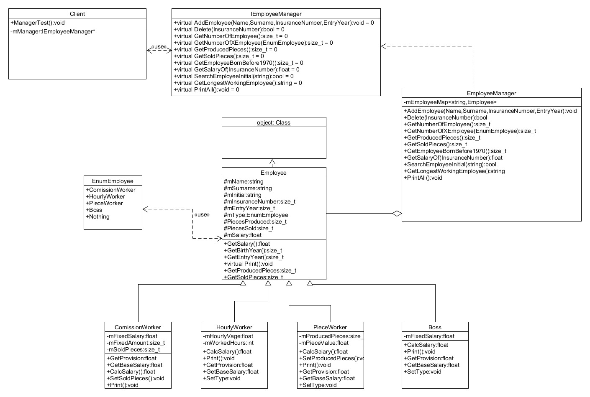
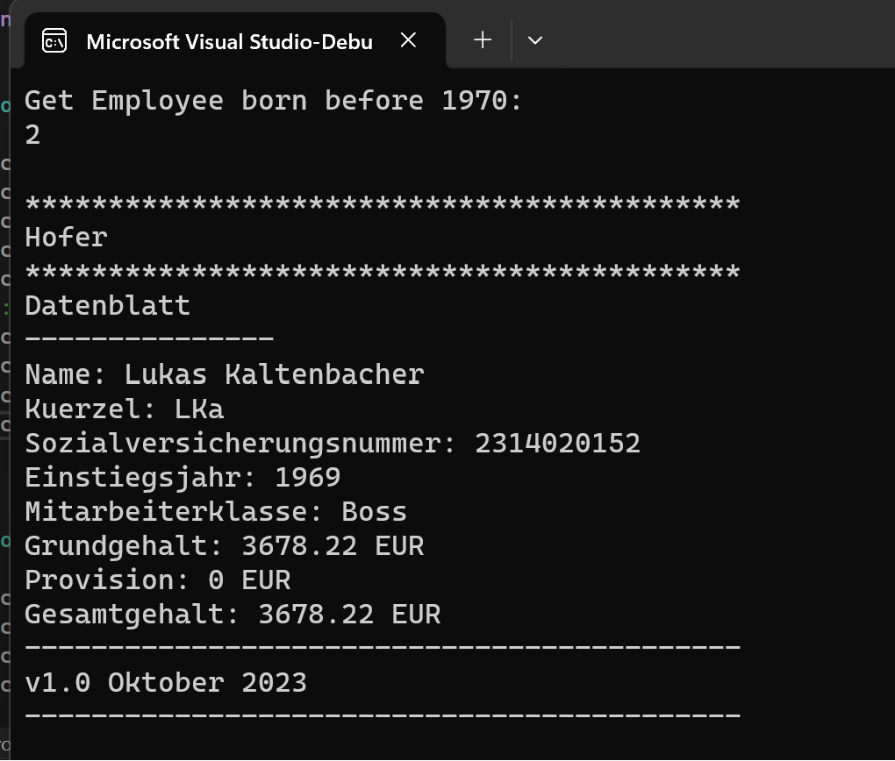

# System Dokumentation Gehaltsberechnung

## Organisatorisches
### Teammitglieder:
*   Paul Engelhardt
*   Harald Kiss


### Arbeitsteilung
* Harald Kiss:
    * UML
    * Code (Architektur)
* Paul Engelhardt: 
    * Systemdoku
    * Tests
    * Code Hilfe

### Geschätzer Arbeitsaufwand
20 Stunden:
* 3 Stunden Plannung
* 15 Stunden Entwicklung
* 2 Stunden Dokumentation


## Anforderungen


### Ziel:
Entwicklung einer Mitarbeiterverwaltungssoftware für ein Unternehmen, die verschiedene Arten von Mitarbeitern unterstützt und die Gehaltsberechnung für jede Art ermöglicht.

### Anforderungen:

Ziel: Entwicklung einer Mitarbeiterverwaltungssoftware für ein Unternehmen, die es ermöglicht, Mitarbeiterdaten zu speichern und verschiedene Arten von Mitarbeitern zu verwalten, wobei jeweils das Gehalt unterschiedlich berechnet wird. Die Software soll auch verschiedene Abfragen und Datenblattaufstellungen unterstützen.

Anforderungen:

* Erfassung von Mitarbeiterdaten.
Unterscheidung zwischen vier Arten von Mitarbeitern und Berechnung des Monatsgehalts auf Grundlage ihrer Art.
* Durchführung von Abfragen zur Gesamtzahl der Mitarbeiter, zur Anzahl der Mitarbeiter nach Art, zu den im Monat erzeugten und verkauften Stücke, zu Mitarbeitern vor 1970 und zu den am längsten in der Firma arbeitenden Mitarbeitern.
* Implementierung der Ausgabe von Mitarbeiterdaten in einem festgelegten Format (Datenblatt) mithilfe einer Template-Methode.
* Einhaltung von Design-Prinzipien und Trennung von Verantwortlichkeiten.
* Erstellung eines Testtreibers zur Überprüfung der Funktionalität der Software.
* Berücksichtigung eines einzelnen Monats für die Stückzahl oder verkauften Stücke pro Mitarbeiter.


## SystemEntwurf


### Klassendiagramm




Im Folgenden werden die Aufgaben des Systems beschrieben

### Mitarbeiterklassen 
Die Software muss die folgenden Mitarbeiterklassen unterstützen: CommissionWorker, HourlyWorker, PieceWorker und Boss.

### Mitarbeiterdaten erfassen
Die Software sollte die Möglichkeit bieten, die folgenden Informationen für jeden Mitarbeiter zu erfassen:

* Vorname und Nachname
* Namenskürzel (3 Buchstaben)
* Sozialversicherungsnummer (mit der Möglichkeit, das Geburtsdatum abzuleiten)
* Einstiegsjahr
* Gehaltsberechnung: Die Software muss die Gehaltsberechnung für verschiedene Mitarbeiterklassen unterstützen, wie in der Aufgabenbeschreibung angegeben.

###  Abfragen

Die Software sollte die folgenden Abfragen ermöglichen:
* Anzahl der Mitarbeiter in der Firma
* Anzahl der CommissionWorker in der Firma
* Gesamtanzahl der erzeugten Stücke im Monat
* Gesamtanzahl der verkauften Stücke im Monat
* Anzahl der Mitarbeiter, die vor 1970 geboren sind
* Monatsgehalt eines Mitarbeiters
* Existenzprüfung eines Mitarbeiters anhand des Namenskürzels
* Ermittlung des am längsten in der Firma arbeitenden Mitarbeiters
* Ausgabe aller Mitarbeiterdaten im angegebenen Format
* Datenbank oder Speicherung: Die Software sollte die Möglichkeit bieten, Mitarbeiterdaten zu speichern, sodass sie zwischen Sitzungen erhalten bleiben.

### Testtreiber
Die Software muss über einen Testtreiber verfügen, der verschiedene Mitarbeiter aus den verschiedenen Gruppen erstellt und die erforderlichen Abfragen durchführt.

Der Testtreiber wird in der Client klasse Implementiert 


### Dokumentation
Die Software sollte gut dokumentiert sein, einschließlich einer Anleitung zur Verwendung und Erklärungen der Datenstrukturen und Algorithmen.


### Berichterstellung 
Die Software sollte die Möglichkeit bieten, Berichte über Mitarbeiterdaten und Gehaltsabrechnungen zu generieren.

In der Aufgabe wird das mittels Terminal Ausgabe sichergestellt.

## KomponentenEntwurf

Siehe Doxygen für Komponentenentwurf

## Doxygen

Siehe Ordner Doxygen/html


## Dateibeschreibung 


Es wurden keine externen Dateien zum ein/aus lesen verwendet


## TestProtokollierung:

Die Tests befinden sich in Client.cpp in der ManagerTest funktion. Diese Funktion testet alle funktionalitäten des Employee Managers.

Dabei wird sicher gegangen das alle Funktionen mindestens einmal getest werden.

Die Tests werden im Terminal ausgegeben

Ein Teil des TestOutputs:



Der Folgende Code Snippit zeigt den vollständigen Testoutput und wie dieser aussschauen soll.


```
Get Employee born before 1970:
2

*******************************************
Hofer
*******************************************
Datenblatt
---------------
Name: Lukas Kaltenbacher
Kuerzel: LKa
Sozialversicherungsnummer: 2314020152
Einstiegsjahr: 1969
Mitarbeiterklasse: Boss
Grundgehalt: 3678.22 EUR
Provision: 0 EUR
Gesamtgehalt: 3678.22 EUR
-------------------------------------------
v1.0 Oktober 2023
-------------------------------------------

Get Number of Employees:
4

Get Number of specific Employee Type:
1

Get Produced Pieces:
15

Get Salary of someone:
1986.75

Get sold Pieces:
222

Does Employee exist:
true

*******************************************
Hofer
*******************************************
Datenblatt
---------------
Name: Herold Leso
Kuerzel: HLe
Sozialversicherungsnummer: 1234041002
Einstiegsjahr: 2020
Mitarbeiterklasse: PieceWorker
Grundgehalt: 6255.2 EUR
Provision: 0 EUR
Gesamtgehalt: 6255.2 EUR
-------------------------------------------
v1.0 Oktober 2023
-------------------------------------------


*******************************************
Hofer
*******************************************
Datenblatt
---------------
Name: Markus Leitner
Kuerzel: MLe
Sozialversicherungsnummer: 1324030673
Einstiegsjahr: 1999
Mitarbeiterklasse: ComissionWorker
Grundgehalt: 2035.96 EUR
Provision: 444 EUR
Gesamtgehalt: 2479.96 EUR
-------------------------------------------
v1.0 Oktober 2023
-------------------------------------------


*******************************************
Hofer
*******************************************
Datenblatt
---------------
Name: Lukas Kaltenbacher
Kuerzel: LKa
Sozialversicherungsnummer: 2314020152
Einstiegsjahr: 1969
Mitarbeiterklasse: Boss
Grundgehalt: 3678.22 EUR
Provision: 0 EUR
Gesamtgehalt: 3678.22 EUR
-------------------------------------------
v1.0 Oktober 2023
-------------------------------------------


*******************************************
Hofer
*******************************************
Datenblatt
---------------
Name: Aaron Luxemburger
Kuerzel: ALu
Sozialversicherungsnummer: 3142021251
Einstiegsjahr: 1969
Mitarbeiterklasse: PieceWorker EUR
Grundgehalt: 0 EUR
Provision: 1986.75 EUR
Gesamtgehalt: 1986.75 EUR
-------------------------------------------
v1.0 Oktober 2023
-------------------------------------------


*******************************************
Hofer
*******************************************
Datenblatt
---------------
Name: Herold Leso
Kuerzel: HLe
Sozialversicherungsnummer: 1234041002
Einstiegsjahr: 2020
Mitarbeiterklasse: PieceWorker
Grundgehalt: 6255.2 EUR
Provision: 0 EUR
Gesamtgehalt: 6255.2 EUR
-------------------------------------------
v1.0 Oktober 2023
-------------------------------------------


*******************************************
Hofer
*******************************************
Datenblatt
---------------
Name: Markus Leitner
Kuerzel: MLe
Sozialversicherungsnummer: 1324030673
Einstiegsjahr: 1999
Mitarbeiterklasse: ComissionWorker
Grundgehalt: 2035.96 EUR
Provision: 444 EUR
Gesamtgehalt: 2479.96 EUR
-------------------------------------------
v1.0 Oktober 2023
-------------------------------------------


*******************************************
Hofer
*******************************************
Datenblatt
---------------
Name: Lukas Kaltenbacher
Kuerzel: LKa
Sozialversicherungsnummer: 2314020152
Einstiegsjahr: 1969
Mitarbeiterklasse: Boss
Grundgehalt: 3678.22 EUR
Provision: 0 EUR
Gesamtgehalt: 3678.22 EUR
-------------------------------------------
v1.0 Oktober 2023
-------------------------------------------
```


## Source code

```cpp
/* File: Object.h
* Creator: Harald Kiss
*/
#ifndef OBJECT_H
#define OBJECT_H

class Object {

public:
	
	virtual ~Object() = default;

protected:
	
	Object() = default;

private:

};

#endif

```
```cpp
/* File: Employee.h
* Creator: Harald Kiss
*/
#ifndef EMPLOYEE_H
#define EMPLOYEE_H

#include "Object.h"
#include <string>
#include <iomanip>
#include <iostream>

/// <summary>
/// Enumeration representing different types of employees.
/// </summary>
typedef enum class EnumEmployee {
    ComissionWorker = 0,
    HourlyWorker = 1,
    PieceWorker = 2,
    Boss = 3,
    Nothing = 4
} EmployeeType;

/// <summary>
/// Base class representing an Employee.
/// </summary>
class Employee : public Object {
public:
    /// <summary>
    /// Get the birth year of the employee from the insurance number.
    /// </summary>
    /// <returns>The birth year of the employee.</returns>
    size_t GetBirthYear();

    /// <summary>
    /// Get the initials of the employee.
    /// </summary>
    /// <returns>The initials of the employee.</returns>
    std::string GetInitial();

    /// <summary>
    /// Get the entry year of the employee.
    /// </summary>
    /// <returns>The entry year of the employee.</returns>
    size_t GetEntryYear();

    /// <summary>
    /// Print information about the employee.
    /// </summary>
    virtual void Print();

    /// <summary>
    /// Print the end of employee information.
    /// </summary>
    void PrintEnd();

    /// <summary>
    /// Get the type of the employee.
    /// </summary>
    /// <returns>The type of the employee.</returns>
    virtual EmployeeType GetType();

    /// <summary>
    /// Get the number of pieces produced by the employee.
    /// </summary>
    /// <returns>The number of pieces produced.</returns>
    virtual size_t GetProducedPieces();

    /// <summary>
    /// Get the number of pieces sold by the employee.
    /// </summary>
    /// <returns>The number of pieces sold.</returns>
    virtual size_t GetSoldPieces();

    /// <summary>
    /// Calculate the salary of the employee.
    /// </summary>
    /// <returns>The calculated salary of the employee.</returns>
    virtual float CalcSalary();

    /// <summary>
    /// Get the provision for the employee.
    /// </summary>
    /// <returns>The provision for the employee.</returns>
    virtual float GetProvision();

protected:
    /// <summary>
    /// Constructor for Employee.
    /// </summary>
    /// <param name="Name">The first name of the employee.</param>
    /// <param name="Surname">The last name of the employee.</param>
    /// <param name="InsuranceNumber">The social insurance number of the employee.</param>
    /// <param name="EntryYear">The year when the employee joined the company.</param>
    Employee(std::string Name, std::string Surname, size_t InsuranceNumber, size_t EntryYear)
        : mName{ Name }, mSurname{ Surname }, mInsuranceNumber{ InsuranceNumber }, mEntryYear{ EntryYear } {};

    std::string mName;
    std::string mSurname;
    size_t mInsuranceNumber;
    size_t mEntryYear;
    EmployeeType mType = EmployeeType::Nothing;
    size_t mPiecesProduced = 0;
    size_t mPiecesSold = 0;
};

#endif

```
```cpp
/* File: Boss.h
* Creator: Harald Kiss
*/
#ifndef BOSS_H
#define BOSS_H

#include "Employee.h"

/// <summary>
/// Class representing a Boss employee.
/// </summary>
class Boss : public Employee {
public:
    /// <summary>
    /// Constructor for Boss.
    /// </summary>
    /// <param name="Name">The first name of the Boss.</param>
    /// <param name="Surname">The last name of the Boss.</param>
    /// <param name="InsuranceNumber">The social insurance number of the Boss.</param>
    /// <param name="EntryYear">The year when the Boss joined the company.</param>
    /// <param name="FixedSalary">The fixed monthly salary of the Boss.</param>
    Boss(std::string Name, std::string Surname, size_t InsuranceNumber, size_t EntryYear, float FixedSalary)
        : Employee{ Name, Surname, InsuranceNumber, EntryYear }, mFixedSalary{ FixedSalary } {};

    /// <summary>
    /// Get the Boss's fixed monthly salary.
    /// </summary>
    /// <returns>The fixed monthly salary of the Boss.</returns>
    float GetBaseSalary();

    /// <summary>
    /// Gets provisions
    /// </summary>
    /// <returns></returns>
    float GetProvision();

    /// <summary>
    /// Calculate the total monthly salary for the Boss.
    /// </summary>
    /// <returns>The total monthly salary, including any additional provisions.</returns>
    float CalcSalary() override { return GetProvision() + GetBaseSalary(); };

    /// <summary>
    /// Print information about the Boss.
    /// </summary>
    void Print() override;

    /// <summary>
    /// Get the type of the employee (Boss).
    /// </summary>
    /// <returns>The type of the employee (Boss).</returns>
    EmployeeType GetType() override;

private:
    float mFixedSalary; /// <summary> The fixed monthly salary of the Boss. </summary>
};

#endif

```
```cpp
/* File: Client.h
* Creator: Paul Engelhardt
*/
#ifndef CLIENT_H
#define CLIENT_H

#include <iostream>

class EmployeeManager; // Forward declaration to avoid circular dependencies

/// <summary>
/// Class representing a client that tests the EmployeeManager.
/// </summary>
class Client {
public:
    /// <summary>
    /// Constructor for the Client class.
    /// </summary>
    /// <param name="manager">A pointer to the EmployeeManager used for testing.</param>
    Client(EmployeeManager* manager) : mManager(manager) {};

    /// <summary>
    /// Perform testing on the EmployeeManager.
    /// </summary>
    void ManagerTest();

private:
    EmployeeManager* mManager; ///< <summary> A pointer to the EmployeeManager for testing. </summary>
};

#endif

```
```cpp
/* File: CommissionWorer.h
* Creator: Harald Kiss
*/
#ifndef COMISSIONWORKER_H
#define COMISSIONWORKER_H

#include "Employee.h"

/// <summary>
/// Class representing a Commission Worker employee.
/// </summary>
class ComissionWorker : public Employee {
public:
    /// <summary>
    /// Constructor for Commission Worker.
    /// </summary>
    /// <param name="Name">The first name of the Commission Worker.</param>
    /// <param name="Surname">The last name of the Commission Worker.</param>
    /// <param name="InsuranceNumber">The social insurance number of the Commission Worker.</param>
    /// <param name="EntryYear">The year when the Commission Worker joined the company.</param>
    /// <param name="FixedSalary">The fixed monthly salary of the Commission Worker.</param>
    /// <param name="FixedAmount">The fixed amount per sold piece.</param>
    /// <param name="SoldPieces">The number of pieces sold by the Commission Worker.</param>
    ComissionWorker(std::string Name, std::string Surname, size_t InsuranceNumber, size_t EntryYear, float FixedSalary, size_t FixedAmount, size_t SoldPieces)
        : Employee{ Name, Surname, InsuranceNumber, EntryYear }, mFixedSalary{ FixedSalary }, mFixedAmount{ FixedAmount }, mSoldPieces{ SoldPieces } {};

    /// <summary>
    /// Get the provision for the Commission Worker.
    /// </summary>
    /// <returns>The provision for the Commission Worker.</returns>
    float GetProvision() override;

    /// <summary>
    /// Get the base monthly salary for the Commission Worker.
    /// </summary>
    /// <returns>The base monthly salary of the Commission Worker.</returns>
    float GetBaseSalary();

    /// <summary>
    /// Calculate the total monthly salary for the Commission Worker.
    /// </summary>
    /// <returns>The total monthly salary, including any additional provisions.</returns>
    float CalcSalary() override { return GetProvision() + GetBaseSalary(); };

    /// <summary>
    /// Get the number of pieces sold by the Commission Worker.
    /// </summary>
    /// <returns>The number of pieces sold by the Commission Worker.</returns>
    size_t GetSoldPieces() override;

    /// <summary>
    /// Set the number of pieces sold by the Commission Worker.
    /// </summary>
    void SetSoldPieces();

    void Print() override;

    /// <summary>
    /// Get the type of the employee (Commission Worker).
    /// </summary>
    /// <returns>The type of the employee (Commission Worker).</returns>
    EmployeeType GetType() override;

private:
    float mFixedSalary; /// <summary> The fixed monthly salary of the Commission Worker. </summary>
    size_t mFixedAmount; /// <summary> The fixed amount per sold piece. </summary>
    size_t mSoldPieces; /// <summary> The number of pieces sold by the Commission Worker. </summary>
};

#endif

```
```cpp
/* File: HourlyWorker.h
* Creator: Harald Kiss
*/
#ifndef HOURLYWORKER_H
#define HOURLYWORKER_H

#include "Employee.h"

/// <summary>
/// Class representing an Hourly Worker employee.
/// </summary>
class HourlyWorker : public Employee {
public:
    /// <summary>
    /// Constructor for Hourly Worker.
    /// </summary>
    /// <param name="Name">The first name of the Hourly Worker.</param>
    /// <param name="Surname">The last name of the Hourly Worker.</param>
    /// <param name="InsuranceNumber">The social insurance number of the Hourly Worker.</param>
    /// <param name="EntryYear">The year when the Hourly Worker joined the company.</param>
    /// <param name="HourlyVage">The hourly wage of the Hourly Worker.</param>
    /// <param name="WorkedHours">The number of hours worked by the Hourly Worker.</param>
    HourlyWorker(std::string Name, std::string Surname, size_t InsuranceNumber, size_t EntryYear, float HourlyVage, int WorkedHours)
        : Employee{ Name, Surname, InsuranceNumber, EntryYear }, mHourlyVage{ HourlyVage }, mWorkedHours{ WorkedHours } {};

    /// <summary>
    /// Get the provision for the Hourly Worker.
    /// </summary>
    /// <returns>The provision for the Hourly Worker (not applicable to Hourly Workers).</returns>
    float GetProvision() override;

    /// <summary>
    /// Get the base monthly salary for the Hourly Worker.
    /// </summary>
    /// <returns>The base monthly salary based on hourly wage and worked hours.</returns>
    float GetBaseSalary();

    /// <summary>
    /// Calculate the total monthly salary for the Hourly Worker.
    /// </summary>
    /// <returns>The total monthly salary, including any additional provisions.</returns>
    float CalcSalary() override { return GetProvision() + GetBaseSalary(); };

    /// <summary>
    /// Print information about the Hourly Worker.
    /// </summary>
    void Print() override;

    /// <summary>
    /// Get the type of the employee (Hourly Worker).
    /// </summary>
    /// <returns>The type of the employee (Hourly Worker).</returns>
    EmployeeType GetType() override;

private:
    float mHourlyVage; ///< <summary> The hourly wage of the Hourly Worker. </summary>
    int mWorkedHours; ///< <summary> The number of hours worked by the Hourly Worker. </summary>
};

#endif

```
```cpp
/* File: PieceWorker.h
* Creator: Harald Kiss
*/
#ifndef PIECEWORKER_H
#define PIECEWORKER_H

#include "Employee.h"

/// <summary>
/// Class representing a Piece Worker employee.
/// </summary>
class PieceWorker : public Employee {
public:
    /// <summary>
    /// Constructor for Piece Worker.
    /// </summary>
    /// <param name="Name">The first name of the Piece Worker.</param>
    /// <param name="Surname">The last name of the Piece Worker.</param>
    /// <param name="InsuranceNumber">The social insurance number of the Piece Worker.</param>
    /// <param name="EntryYear">The year when the Piece Worker joined the company.</param>
    /// <param name="PieceValue">The value of each piece produced by the Piece Worker.</param>
    /// <param name="ProducedPieces">The number of pieces produced by the Piece Worker.</param>
    PieceWorker(std::string Name, std::string Surname, size_t InsuranceNumber, size_t EntryYear, float PieceValue, size_t ProducedPieces)
        : Employee{ Name, Surname, InsuranceNumber, EntryYear }, mPieceValue{ PieceValue }, mProducedPieces{ ProducedPieces } {};

    /// <summary>
    /// Get the provision for the Piece Worker.
    /// </summary>
    /// <returns>The provision for the Piece Worker.</returns>
    float GetProvision();

    /// <summary>
    /// Get the base monthly salary for the Piece Worker.
    /// </summary>
    /// <returns>The base monthly salary based on the value of produced pieces.</returns>
    float GetBaseSalary();

    /// <summary>
    /// Calculate the total monthly salary for the Piece Worker.
    /// </summary>
    /// <returns>The total monthly salary, including any additional provisions.</returns>
    float CalcSalary() override { return GetProvision() + GetBaseSalary(); };

    /// <summary>
    /// Get the number of pieces produced by the Piece Worker.
    /// </summary>
    /// <returns>The number of pieces produced by the Piece Worker.</returns>
    size_t GetProducedPieces() override;

    /// <summary>
    /// Print information about the Piece Worker.
    /// </summary>
    void Print() override;

    /// <summary>
    /// Set the number of pieces produced by the Piece Worker.
    /// </summary>
    void SetPieces();

    /// <summary>
    /// Get the type of the employee (Piece Worker).
    /// </summary>
    /// <returns>The type of the employee (Piece Worker).</returns>
    EmployeeType GetType() override;

private:
    size_t mProducedPieces; ///< <summary> The number of pieces produced by the Piece Worker. </summary>
    float mPieceValue; ///< <summary> The value of each piece produced by the Piece Worker. </summary>
};

#endif

```
```cpp
/* File: EmployeeManager.h
 * Creator: Paul Engelhardt
 */

#ifndef EMPLOYEEMANAGER_H
#define EMPLOYEEMANAGER_H

#include "Employee.h"
#include <map>
#include <vector>
#include "Client.h"

typedef std::map<size_t, Employee*> EmployeeMap;

/// <summary>
/// Class responsible for managing employees.
/// </summary>
class EmployeeManager {
public:
    /// <summary>
    /// Add an employee to the manager.
    /// </summary>
    /// <param name="InsuranceNumber">The social insurance number of the employee.</param>
    /// <param name="Emp">A pointer to the employee to be added.</param>
    void AddEmployee(size_t InsuranceNumber, Employee* Emp);

    /// <summary>
    /// Delete an employee from the manager.
    /// </summary>
    /// <param name="InsuranceNumber">The social insurance number of the employee to be deleted.</param>
    /// <returns>True if the employee was successfully deleted; false if the employee was not found.</returns>
    bool Delete(size_t InsuranceNumber);

    /// <summary>
    /// Get the total number of employees in the manager.
    /// </summary>
    /// <returns>The total number of employees.</returns>
    size_t GetNumberOfEmployee();

    /// <summary>
    /// Get the total number of employees of a specific type.
    /// </summary>
    /// <param name="Type">The type of employees to count.</param>
    /// <returns>The total number of employees of the specified type.</returns>
    size_t GetNumberOfXEmployee(EnumEmployee Type);

    /// <summary>
    /// Get the total number of pieces produced by all employees.
    /// </summary>
    /// <returns>The total number of pieces produced.</returns>
    size_t GetProducedPieces();

    /// <summary>
    /// Get the total number of pieces sold by all employees.
    /// </summary>
    /// <returns>The total number of pieces sold.</returns>
    size_t GetSoldPieces();

    /// <summary>
    /// Get the total number of employees born before the year 1970.
    /// </summary>
    /// <returns>The total number of employees born before 1970.</returns>
    size_t GetEmployeeBornBefore1970();

    /// <summary>
    /// Get the monthly salary of an employee with a specific insurance number.
    /// </summary>
    /// <param name="InsuranceNumber">The social insurance number of the employee.</param>
    /// <returns>The monthly salary of the employee.</returns>
    float GetSalaryOf(size_t InsuranceNumber);

    /// <summary>
    /// Search for an employee by their initials.
    /// </summary>
    /// <param name="InitialName">The initials to search for.</param>
    /// <returns>True if an employee with the specified initials is found; false otherwise.</returns>
    bool SearchEmployeeInitial(std::string InitialName);

    /// <summary>
    /// Get the employee with the longest tenure in the company.
    /// </summary>
    /// <returns>A pointer to the employee with the longest tenure.</returns>
    Employee* GetLongestWorkingEmployee();

    /// <summary>
    /// Print information about all employees.
    /// </summary>
    void PrintAll();

private:
    EmployeeMap mEmployeeMap; ///< <summary> A map to store employees with their social insurance numbers as keys. </summary>
};

#endif

```
```cpp
/* File: Boss.cpp
* Creator: Harald Kiss
*/
#include "Boss.h"

float Boss::GetProvision()
{
	return 0.0f;
}

float Boss::GetBaseSalary()
{
	return mFixedSalary;
}

void Boss::Print()
{

    Employee::Print();
    std::cout << "Mitarbeiterklasse: " << "Boss" << std::endl;
    std::cout << "Grundgehalt: " << GetBaseSalary() << " EUR" << std::endl;
    std::cout << "Provision: " << GetProvision() << " EUR" << std::endl;
    std::cout << "Gesamtgehalt: " << CalcSalary() << " EUR" << std::endl;
    Employee::PrintEnd();

}

EmployeeType Boss::GetType()
{
    return EmployeeType::Boss;
}


```
```cpp
/* File: Client.cpp
* Creator: Paul Engelhardt
*/
#include "Client.h"
#include "algorithm"

#include "EmployeeManager.h"
#include "Boss.h"
#include "ComissionWorker.h"
#include "PieceWorker.h"
#include "HourlyWorker.h"
#include "Employee.h"


void Client::ManagerTest()
{

	//DO The tests here

	auto emp1 = ComissionWorker{ "Markus", "Leitner", 1324030673, 1999, 2035.96, 2, 222 };
	auto emp2 = HourlyWorker{ "Herold", "Leso", 1234041002, 2020, 22.34, 280 };
	auto emp3 = Boss{ "Lukas" , "Kaltenbacher", 2314020152, 1969, 3678.22 };
	auto emp4 = PieceWorker{ "Aaron", "Luxemburger", 3142021251, 1969, 132.45, 15 };
#

	mManager->AddEmployee(1324030673, &emp1);
	mManager->AddEmployee(1234041002, &emp2);
	mManager->AddEmployee(2314020152, &emp3);
	mManager->AddEmployee(3142021251, &emp4);
	std::cout << "Get Employee born before 1970: " << std::endl << mManager->GetEmployeeBornBefore1970() << std::endl << std::endl;

	auto longest  = mManager->GetLongestWorkingEmployee();
	
	longest->Print();

	std::cout << "Get Number of Employees: " << std::endl << mManager->GetNumberOfEmployee() << std::endl << std::endl;

	std::cout << "Get Number of specific Employee Type: " << std::endl << mManager->GetNumberOfXEmployee(EnumEmployee::ComissionWorker) << std::endl << std::endl;

	std::cout << "Get Produced Pieces: " << std::endl << mManager->GetProducedPieces() << std::endl << std::endl;

	std::cout << "Get Salary of someone: " << std::endl << mManager->GetSalaryOf(3142021251) << std::endl << std::endl;

	std::cout << "Get sold Pieces: " << std::endl << mManager->GetSoldPieces() << std::endl << std::endl;

	std::cout << "Does Employee exist: " << std::endl << std::boolalpha << mManager->SearchEmployeeInitial("LKa") << std::endl << std::endl;

	mManager->PrintAll();

	mManager->Delete(3142021251);

	mManager->PrintAll();

}
```
```cpp
/* File: CommsionWorker.cpp
* Creator: Harald Kiss
*/
#include "ComissionWorker.h"

float ComissionWorker::GetProvision()
{
    return mFixedAmount * mSoldPieces;
}

float ComissionWorker::GetBaseSalary()
{
    return mFixedSalary;
}

size_t ComissionWorker::GetSoldPieces()
{
    return mSoldPieces;
}

void ComissionWorker::Print()
{
   
    Employee::Print();
    std::cout << "Mitarbeiterklasse: " << "ComissionWorker" << std::endl;
    std::cout << "Grundgehalt: " << GetBaseSalary() << " EUR" << std::endl;
    std::cout << "Provision: " << GetProvision() << " EUR" << std::endl;
    std::cout << "Gesamtgehalt: " << CalcSalary() << " EUR" << std::endl;
    Employee::PrintEnd();


}


void ComissionWorker::SetSoldPieces()
{

    mPiecesSold = mSoldPieces;

}

EmployeeType ComissionWorker::GetType()
{
    return EmployeeType::ComissionWorker;
}

```
```cpp
/* File: Employee.cpp
* Creator: Harald Kiss
*/
#include "Employee.h"
#include <iostream>

static const size_t  Year1 = 1900;
static const size_t Year2 = 2000;
static const std::string NoSurname = "No actual Surname";

/*float Employee::CalcSalary()
{


    
}*/

/*float Employee::GetProvision()
{
    
}

float Employee::GetBaseSalary()
{
    
}*/

size_t Employee::GetBirthYear()
{
    size_t Temp = mInsuranceNumber % 100;

    if (Temp > 23) {

        return Year1 + Temp;

    }
    else {

        return Year2 + Temp;

    }

}

std::string Employee::GetInitial()
{
    if (mSurname.size() > 0) {
        std::string str1 = mName.substr(0, 1);
        std::string str2 = mSurname.substr(0, 1);
        std::string str3;

        if (mSurname.size() > 1) {
            str3 = mSurname.substr(1, 1);
        }

        std::string out = str1 + str2 + str3;
        return out;
    }
    else {
        // Handle the case where there is no surname (you can throw an exception or return an appropriate value)
        // For now, let's return an empty string.
        return "";
    }
}


size_t Employee::GetEntryYear()
{
    return mEntryYear;
}

void Employee::Print()
{
    std::cout << "*******************************************" << std::endl;
    std::cout << "Hofer" << std::endl;
    std::cout << "*******************************************" << std::endl;
    std::cout << "Datenblatt" << std::endl;
    std::cout << "---------------" << std::endl;
    //std::cout << std::endl;
    std::cout << "Name: " << mName << " " << mSurname << std::endl;
    std::cout << "Kuerzel: " << GetInitial() << std::endl;
    std::cout << "Sozialversicherungsnummer: " << mInsuranceNumber << std::endl;
    std::cout << "Einstiegsjahr: " << GetEntryYear() << std::endl;
    
}

void Employee::PrintEnd() {

    std::cout << "-------------------------------------------" << std::endl;
    std::cout << "v1.0 Oktober 2023" << std::endl;
    std::cout << "-------------------------------------------" << std::endl;
    std::cout << std::endl;
}


EnumEmployee Employee::GetType()
{
    return mType;
}

size_t Employee::GetProducedPieces()
{
    return mPiecesProduced;
}

size_t Employee::GetSoldPieces()
{
    return mPiecesSold;
}

float Employee::CalcSalary()
{
    return 0.0f;
}

float Employee::GetProvision()
{
    return 0.0f;
}


```
```cpp
/* File: EmployeeManager.cpp
* Creator: Paul Engelhardt
*/
#include "EmployeeManager.h"
#include "Employee.h"
#include <algorithm>
#include <iterator>

static const size_t Year2023 = 2023;
static const std::string NoEmployeeFound = "No such Employee found.";
static const std::string NoEmployeeWithMatchingInsurance = "No Employee with matching Insurance Number found.";

void EmployeeManager::AddEmployee(size_t InsuranceNumber, Employee* Emp)
{

	mEmployeeMap.insert({ InsuranceNumber, Emp });

}

bool EmployeeManager::Delete(size_t InsuranceNumber)
{
	if (mEmployeeMap.erase(InsuranceNumber))	
	{ 
		return true;
	}
	else {
	
		std::cout << NoEmployeeFound << std::endl;
		return false;
	}

}

size_t EmployeeManager::GetNumberOfEmployee()
{

	return mEmployeeMap.size();

}

size_t EmployeeManager::GetNumberOfXEmployee(EnumEmployee Type)
{
	size_t tmp = 0;

	for (auto It = mEmployeeMap.cbegin(); It != mEmployeeMap.cend(); It++) {

		auto tmpo = It->second->GetType();

		if (tmpo == Type) {

			tmp++;

		}

	}
	
	return tmp;
}

size_t EmployeeManager::GetProducedPieces()
{
	size_t PiecesProducedSum = 0;

	for(auto It : mEmployeeMap){

		if (It.second->GetType() == EnumEmployee::PieceWorker) {

			PiecesProducedSum += It.second->GetProducedPieces();

		}

	}

	return PiecesProducedSum;
}

size_t EmployeeManager::GetSoldPieces()
{
	size_t PiecesSoldSum = 0;

	for (auto It = mEmployeeMap.cbegin(); It != mEmployeeMap.cend(); It++) {

		if (It->second->GetType() == EnumEmployee::ComissionWorker) {

			PiecesSoldSum += It->second->GetSoldPieces();

		}

	}

	return PiecesSoldSum;

}

size_t EmployeeManager::GetEmployeeBornBefore1970()
{
	size_t Before = 0;

	for (auto It = mEmployeeMap.cbegin(); It != mEmployeeMap.cend(); It++) {

		if (It->second->GetBirthYear() < 1970) {

			Before++;

		}

	}

	return Before;
}

float EmployeeManager::GetSalaryOf(size_t InsuranceNumber)
{
	if (mEmployeeMap.find(InsuranceNumber)->second) {

		return mEmployeeMap.find(InsuranceNumber)->second->CalcSalary();

	}
	else {

		std::cout << NoEmployeeWithMatchingInsurance << std::endl;

		return 0.0;

	}
	
}

bool EmployeeManager::SearchEmployeeInitial(std::string InitialName)
{
	for (auto It = mEmployeeMap.cbegin(); It != mEmployeeMap.cend(); It++) {

		if (It->second->GetInitial() == InitialName) {

			return true;

		}

	}
	
	return false;
}

Employee* EmployeeManager::GetLongestWorkingEmployee()
{

	if (mEmployeeMap.size() == 0) return nullptr;
	Employee* cur = mEmployeeMap.begin()->second;

	for (auto emp : mEmployeeMap)
	{
		if (emp.second->GetEntryYear() < cur->GetEntryYear())
		{
			cur = emp.second;
		}
	}

	return cur;
}

void EmployeeManager::PrintAll()
{

	for (auto It = mEmployeeMap.cbegin(); It != mEmployeeMap.cend(); It++) {

		It->second->Print();
		std::cout << std::endl;

	}

}

```
```cpp
/* File: HourlyWorker.cpp
* Creator: Harald Kiss
*/
#include "HourlyWorker.h"

float HourlyWorker::GetProvision()
{
    return 0;
}

float HourlyWorker::GetBaseSalary()
{
    return mHourlyVage * mWorkedHours;
}

void HourlyWorker::Print()
{

    Employee::Print();
    std::cout << "Mitarbeiterklasse: " << "PieceWorker" << std::endl;
    std::cout << "Grundgehalt: " << GetBaseSalary() << " EUR" << std::endl;
    std::cout << "Provision: " << GetProvision() << " EUR" << std::endl;
    std::cout << "Gesamtgehalt: " << CalcSalary() << " EUR" << std::endl;
    Employee::PrintEnd();


}

EmployeeType HourlyWorker::GetType()
{
    return EmployeeType::HourlyWorker;
}

```
```cpp
/* File: PieceWorker.cpp
* Creator: Harald Kiss
*/
#include "PieceWorker.h"

float PieceWorker::GetProvision()
{
    return mProducedPieces * mPieceValue;
}

float PieceWorker::GetBaseSalary()
{
    return 0.0;
}

size_t PieceWorker::GetProducedPieces()
{
    return mProducedPieces;
}

void PieceWorker::Print()
{

    Employee::Print();
    std::cout << "Mitarbeiterklasse: " << "PieceWorker" << " EUR" << std::endl;
    std::cout << "Grundgehalt: " << GetBaseSalary() << " EUR" << std::endl;
    std::cout << "Provision: " << GetProvision() << " EUR" << std::endl;
    std::cout << "Gesamtgehalt: " << CalcSalary() << " EUR" << std::endl;
    Employee::PrintEnd();


}

void PieceWorker::SetPieces()
{

    mPiecesProduced = mProducedPieces;

}

EmployeeType PieceWorker::GetType()
{
    return EmployeeType::PieceWorker;
}

```
```cpp
/* File: Uebung02.cpp (Main)
* Creator: Harald Kiss
*/
#include <iostream>
#include "Client.h"
#include "EmployeeManager.h"
#include "Employee.h"
#include "Boss.h"
#include "ComissionWorker.h"
#include "HourlyWorker.h"
#include "PieceWorker.h"
#include <string>

using namespace std;

int main() {
		
		EmployeeManager Test;

		Client ClientObj{ &Test };


		/// All tests are inside this client ManagerTest
		ClientObj.ManagerTest();

		return 0;

		
}
```