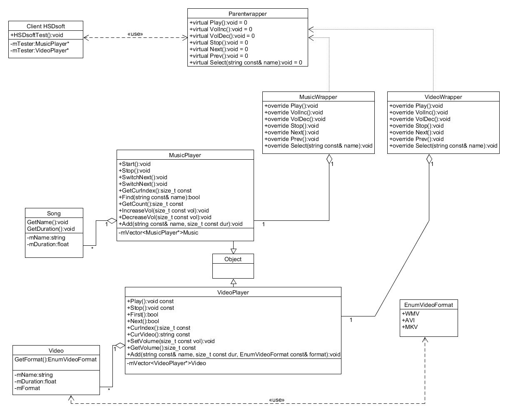
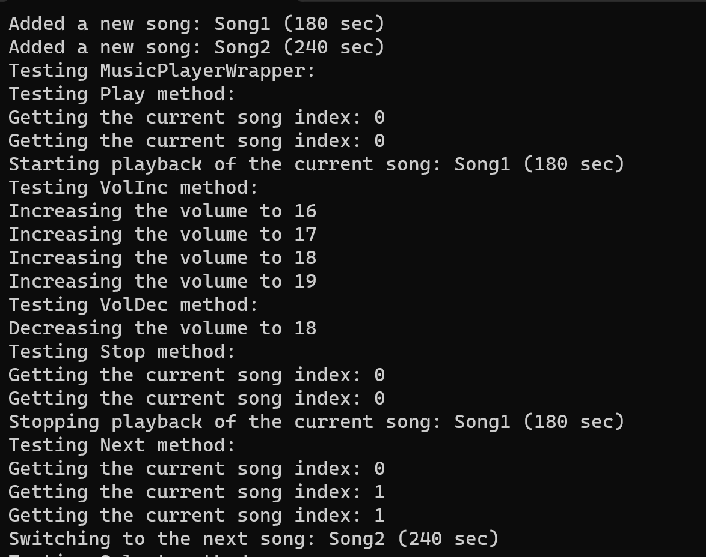

# System Dokumentation MediaPlayer

## Organisatorisches

### Teammitglieder
- Paul Engelhardt
- Harald Kiss

### Arbeitsteilung
- Harald Kiss:
  - UML-Diagramm
  - Tests
- Paul Engelhardt:
  - Systemdokumentation
  - Code (Architektur)
  - Unterstützung bei der Code-Entwicklung

### Geschätzter Arbeitsaufwand
20 Stunden:
- 3 Stunden für die Planung
- 15 Stunden für die Entwicklung
- 2 Stunden für die Dokumentation

## Anforderungen

### Ziel
Entwicklung einer Media-Player-Anwendung, die es ermöglicht, verschiedene Arten von Medien abzuspielen und zu verwalten, einschließlich Musik und Videos, mit einer einheitlichen Schnittstelle.


Folgenden Funktionen sind bereits vordefinidert von einem lieferanten und müssen an den Wrapper angepasst werden.
#### MusicPlayer-Funktionen


```cpp
//starts playing with the current song in list
2 void Start();
3 //stops playing
4 void Stop();
5 //switches to next song and starts at the end with first song
6 void SwitchNext();
7 //get index of current song
8 size_t const GetCurIndex() const;
9 //find a song by name in playlist
10 bool Find(std::string const& name);
11 //get count of songs in playlist
12 size_t const GetCount() const;
13 //increase the volume relative to the current volume
14 void IncreaseVol(size_t const vol);
15 //decrease the volume relative to the current volume
16 void DecreaseVol(size_t const vol);
17 //add a song to playlist
18 void Add(std::string const& name, size_t const dur);

```


#### VideoPlayer-Funktionen


```cpp
1 //starts playing with the current song in list
2 void Play() const;
3 //stops playing
4 void Stop() const;
5 //switches to first video in playlist and returns true, otherwise false if list is empty.
6 bool First();
7 //switches to next video in playlist and returns true, otherwise false if last song is reached.
8 bool Next();
9 //returns index of current video
10 size_t CurIndex() const;
11 //returns name of current video
12 std::string const CurVideo() const;
13 //sets volume (min volume=0 and max volume=50)
14 void SetVolume(size_t const vol);
15 //gets current volume
16 size_t const GetVolume() const;
17 //adds a vidoe to playlist
18 void Add(std::string const& name, size_t const dur, VideoFormat const& format);

```


#### IMediaWrapper-Schnittstelle
- Erstellung einer IMediaWrapper-Schnittstelle, die eine einheitliche Schnittstelle für Media-Player definiert. Die IMediaWrapper-Schnittstelle enthält folgende Funktionen:
  - `Play()`: Startet die Wiedergabe des aktuellen Mediums.
  - `VolInc()`: Erhöht die Lautstärke.
  - `VolDec()`: Verringert die Lautstärke.
  - `Stop()`: Stoppt die Wiedergabe.
  - `Next()`: Wechselt zum nächsten Medium in der Playlist.
  - `Prev()`: Wechselt zum vorherigen Medium in der Playlist.
  - `Select(std::string const& name)`: Wählt ein Medium aus der Playlist anhand des Namens aus.

Die IMediaWrapper-Schnittstelle ermöglicht es, sowohl MusicPlayer als auch VideoPlayer über eine einheitliche Schnittstelle zu steuern, wodurch die Anwendung flexibel und benutzerfreundlich wird. Diese Schnittstelle ermöglicht dem Benutzer, die Medienwiedergabe und -verwaltung unabhängig von der Art des Mediums (Musik oder Video) zu steuern.

## Systementwurf


#### Allgemeines

Um sicherzustellen das man sowohl den MusicPlayer als auch den Videoplayer mittels den gleichen Funktionen verwenden kann wurden Adapeter(Wrapper) verwendet.

 Dabei ist zu bedenken dass nicht jede gewünschte Funktion des Wrappers auch von den darunterliegenden MusicPlayer/Videoplayer unterstützt werden kann da zum Beispiel sein kann das  beim  VideoPlayer eine gewünschte Funktionalität nicht implementiert ist.

### Klassendiagramm



Das Klassendiagramm zeigt die Struktur des Systems und die Beziehungen zwischen den verschiedenen Komponenten.

### MusicPlayer-Klasse

Der MusicPlayer verwaltet Musikstücke und bietet Funktionen zum Starten, Stoppen, Wechseln, Suchen, Verwalten von Liedern und Anpassen der Lautstärke.

### VideoPlayer-Klasse

Der VideoPlayer verwaltet Videos und bietet Funktionen zum Starten, Stoppen, Wechseln, Suchen, Verwalten von Videos und Anpassen der Lautstärke.

### IMediaWrapper(ParentWrapper)-Schnittstelle

Die IMediaWrapper-Schnittstelle definiert eine einheitliche Schnittstelle für Media-Player, die sowohl MusicPlayer als auch VideoPlayer verwenden können. Die Schnittstelle enthält Funktionen zum Abspielen, Ändern der Lautstärke, Stoppen, Wechseln und Auswählen von Medien.

### MusicPlayerWrapper-Klasse

Die MusicPlayerWrapper-Klasse implementiert die IMediaWrapper-Schnittstelle und dient dazu, den MusicPlayer mit der einheitlichen Schnittstelle zu verwenden.

### VideoPlayerWrapper-Klasse

Die VideoPlayerWrapper-Klasse implementiert die IMediaWrapper-Schnittstelle und dient dazu, den VideoPlayer mit der einheitlichen Schnittstelle zu verwenden.

## Komponentenentwurf

Siehe Doxygen-Dokumentation für detaillierte Informationen zum Komponentenentwurf.

## Doxygen

Die Doxygen-Dokumentation enthält ausführliche Informationen zum Code, zur Klassenstruktur und zur Verwendung der einzelnen Komponenten. Sie ist im Ordner "Doxygen/html" verfügbar.

## Dateibeschreibung

Das Projekt verwendet keine externen dateien zum lesen/schreiben von Daten

## Testprotokollierung


Die vollständigen Tests befinden sich in Client.cpp und ermöglichen das umfassende Testen der Media-Player-Funktionalitäten, einschließlich Abspielen, Lautstärkeänderung, Stoppen, Wechseln und Auswählen von Medien.


Dabei wird sicher gegangen das alle Funktionen mindestens einmal getest werden.

Die Tests werden im Terminal ausgegeben

Ein Teil des TestOutputs:



Der Folgende Code Snippit zeigt den vollständigen Testoutput und wie dieser aussschauen soll.


```
Added a new song: Song1 (180 sec)
Added a new song: Song2 (240 sec)
Testing MusicPlayerWrapper:
Testing Play method:
Getting the current song index: 0
Getting the current song index: 0
Starting playback of the current song: Song1 (180 sec)
Testing VolInc method:
Increasing the volume to 16
Increasing the volume to 17
Increasing the volume to 18
Increasing the volume to 19
Testing VolDec method:
Decreasing the volume to 18
Testing Stop method:
Getting the current song index: 0
Getting the current song index: 0
Stopping playback of the current song: Song1 (180 sec)
Testing Next method:
Getting the current song index: 0
Getting the current song index: 1
Getting the current song index: 1
Switching to the next song: Song2 (240 sec)
Testing Select method:
Getting the current song index: 0
Getting the current song index: 0
Found and selected the song: Song1 (180 sec)
Added a new video: Video1 [duration -> 120 min], Format: WMV
Added a new video: Video2 [duration -> 180 min], Format: AVI

Testing VideoPlayerWrapper:
Testing Play method:
Playing video number 1: Video1 [duration -> 120 min], Format: WMV
Testing VolInc method:
Set the volume to 1
Set the volume to 2
Set the volume to 3
Set the volume to 4
Testing VolDec method:
Set the volume to 3
Testing Stop method:
Stopped playing video: Video1 [duration -> 120 min], Format: WMV
Testing Next method:
Playing video number 2: Video2 [duration -> 180 min], Format: AVI
Testing Select method:
Not supported by video player

```


## Sourcode


```cpp
/* File: Client.h
* Creator: Paul Engelhardt
*/
#ifndef CLIENT_H
#define CLIENT_H

#include <iostream>

/// <summary>
/// Class representing a client that tests the EmployeeManager.
/// </summary>
class Client {
public:
    /// <summary>
    /// Constructor for the Client class.
    /// </summary>
    Client() = default;

    /// <summary>
    /// Perform testing on the players.
    /// </summary>
    void TestPlayers();

private:
};

#endif
```


```cpp
/* File: IMediaWrapper.hpp
* Creator: Paul Engelhardt
*/

#pragma once
#include <string>
#include "Object.hpp"

/// <summary>
/// The IMediaWrapper class serves as an interface for wrapping media players.
/// </summary>
class IMediaWrapper : Object {
public:
    /// <summary>
    /// Default constructor.
    /// </summary>
    IMediaWrapper() = default;

    /// <summary>
    /// Default destructor.
    /// </summary>
    ~IMediaWrapper() = default;

    /// <summary>
    /// Play the current media.
    /// </summary>
    virtual void Play() = 0;

    /// <summary>
    /// Increase the volume.
    /// </summary>
    virtual void VolInc() = 0;

    /// <summary>
    /// Decrease the volume.
    /// </summary>
    virtual void VolDec() = 0;

    /// <summary>
    /// Stop playing the current media.
    /// </summary>
    virtual void Stop() = 0;

    /// <summary>
    /// Play the next media in the playlist.
    /// </summary>
    virtual void Next() = 0;

    /// <summary>
    /// Play the previous media in the playlist.
    /// </summary>
    virtual void Prev() = 0;

    /// <summary>
    /// Select a media by its name from the playlist.
    /// </summary>
    /// <param name="name">The name of the media to select.</param>
    virtual void Select(std::string const& name) = 0;
};

```


```cpp
/* File: MusicPlayer.hpp
* Creator: Paul Engelhardt
*/
#pragma once

#include "Object.hpp"
#include <string>
#include <vector>
#include "Song.hpp"

/// <summary>
/// MusicPlayer
/// </summary>
class MusicPlayer : Object {
public:
	MusicPlayer() = default;
	~MusicPlayer() = default;
	/// <summary>
	/// starts playing with the current song in list
	/// </summary>
	void Start();
	/// <summary>
	/// Stops Playing
	/// </summary>
	void Stop();
	/// <summary>
	/// Switches to Next
	/// </summary>
	void SwitchNext();
	/// <summary>
	/// Gets Current song index
	/// </summary>
	/// <returns></returns>
	size_t const GetCurIndex() const;
	/// <summary>
	/// Finds a Song 
	/// </summary>
	/// <param name="name"></param>
	/// <returns></returns>
	bool Find(std::string const& name);
	/// <summary>
	/// Counts number of songs
	/// </summary>
	/// <returns></returns>
	size_t const GetCount() const;
	/// <summary>
	/// Increase volume
	/// </summary>
	/// <param name="vol"></param>
	void IncreaseVol(size_t const vol);
	/// <summary>
	/// Decrease  Volume
	/// </summary>
	/// <param name="vol"></param>
	void DecreaseVol(size_t const vol);
	/// <summary>
	/// Adds A new Song
	/// </summary>
	/// <param name="name"></param>
	/// <param name="dur"></param>
	void Add(std::string const& name, size_t const dur);
private:
	void SetCurIndex(size_t index);

	size_t currentIndex = 0;
	size_t volume = 15;

	std::vector<Song> songs;
};
```


```cpp
/* File: MusicPlayerWrapper.hpp
 * Creator: Paul Engelhardt
 */

#pragma once

#include "IMediaWrapper.hpp"
#include "MusicPlayer.hpp"
#include <memory>

 /// <summary>
 /// The MusicPlayerWrapper class wraps a MusicPlayer and provides a common interface for media operations.
 /// </summary>
class MusicPlayerWrapper : IMediaWrapper {
public:
    /// <summary>
    /// Constructor to create a MusicPlayerWrapper with a shared MusicPlayer instance.
    /// </summary>
    /// <param name="musicPlayer">A shared pointer to the MusicPlayer instance to be wrapped.</param>
    MusicPlayerWrapper(std::shared_ptr<MusicPlayer> musicPlayer);

    /// <summary>
    /// Destructor for MusicPlayerWrapper.
    /// </summary>
    ~MusicPlayerWrapper();

    /// <summary>
    /// Play the current media.
    /// </summary>
    void Play() override;

    /// <summary>
    /// Increase the volume.
    /// </summary>
    void VolInc() override;

    /// <summary>
    /// Decrease the volume.
    /// </summary>
    void VolDec() override;

    /// <summary>
    /// Stop playing the current media.
    /// </summary>
    void Stop() override;

    /// <summary>
    /// Play the next media in the playlist.
    /// </summary>
    void Next() override;

    /// <summary>
    /// Play the previous media in the playlist.
    /// </summary>
    void Prev() override;

    /// <summary>
    /// Select a media by its name from the playlist.
    /// </summary>
    /// <param name="name">The name of the media to select.</param>
    void Select(std::string const& name) override;

private:
    std::shared_ptr<MusicPlayer> musicPlayer; ///< <summary> A shared pointer to the wrapped MusicPlayer instance. </summary>
};

```

```cpp
/* File: Object.hpp
* Creator: Harald Kiss
*/
#pragma once

#ifndef OBJECT_H
#define OBJECT_H


///Object Base Class
class Object {

public:

	virtual ~Object() = default;

protected:

	Object() = default;

private:

};

#endif
```

```cpp
/* File: Song.hpp
*  Creator: Harald Kiss
*/
#pragma once
#include <string>
#include "Object.hpp"

/// <summary>
/// The Song class represents a song with a name and duration.
/// </summary>
class Song : Object {
public:
    /// <summary>
    /// Constructor to create a song with a specified duration and name.
    /// </summary>
    /// <param name="duration">The duration of the song in seconds.</param>
    /// <param name="name">The name of the song.</param>
    Song(size_t duration, std::string name);

    /// <summary>
    /// Default destructor.
    /// </summary>
    ~Song() = default;

    /// <summary>
    /// Get the duration of the song in seconds.
    /// </summary>
    /// <returns>The duration of the song in seconds.</returns>
    size_t GetDuration();

    /// <summary>
    /// Get the name of the song.
    /// </summary>
    /// <returns>The name of the song.</returns>
    std::string GetName();

private:
    size_t duration; ///< <summary> The duration of the song in seconds. </summary>
    std::string name; ///< <summary> The name of the song. </summary>
};

```

```cpp
/* File: Video.hpp
* Craetor: Harald Kiss
*/
#pragma once
#include <string>
#include "Object.hpp"

/// <summary>
/// Available VideoFormats
/// </summary>
enum class VideoFormat {
	WMV,
	AVI,
	MKV
};


/// <summary>
/// Video
/// </summary>
class Video : Object {
public:
	/// <summary>
	/// Video Consturtor
	/// </summary>
	/// <param name="duration"></param>
	/// <param name="name"></param>
	/// <param name="format"></param>
	Video(size_t duration, std::string name, VideoFormat format);
	~Video() = default;
	/// <summary>
	/// Get Duration
	/// </summary>
	/// <returns></returns>
	size_t GetDuration() const;
	/// <summary>
	/// Get Name
	/// </summary>
	/// <returns></returns>
	std::string GetName() const;
	/// <summary>
	/// Get Video Format
	/// </summary>
	/// <returns></returns>
	VideoFormat GetVideoFormat() const;
private:
	size_t duration;
	std::string name;
	VideoFormat format;
};
```

```cpp
/* File: VideoPlayer.hpp
*  Creator: Paul Engelhardt
*/
#pragma once


#include <string>
#include "Object.hpp"
#include "Video.hpp"
#include <vector>


/// <summary>
/// VideoPlayer class for playing videos with various functionalities.
/// </summary>
class VideoPlayer : Object{
public:
    VideoPlayer() = default;
    ~VideoPlayer() = default;
    /// <summary>
    /// Starts playing the current video in the playlist.
    /// </summary>
    void Play() const;

    /// <summary>
    /// Stops playing the current video.
    /// </summary>
    void Stop() const;

    /// <summary>
    /// Switches to the first video in the playlist and returns true if successful, otherwise false if the list is empty.
    /// </summary>
    bool First();

    /// <summary>
    /// Switches to the next video in the playlist and returns true if successful, otherwise false if the last video is reached.
    /// </summary>
    bool Next();

    /// <summary>
    /// Returns the index of the current video in the playlist.
    /// </summary>
    /// <returns>The index of the current video.</returns>
    size_t CurIndex() const;

    /// <summary>
    /// Returns the name of the current video.
    /// </summary>
    /// <returns>The name of the current video.</returns>
    std::string const CurVideo() const;

    /// <summary>
    /// Sets the volume level of the video player.
    /// </summary>
    /// <param name="vol">The volume level to set (0 to 50, where 0 is mute and 50 is maximum volume).</param>
    void SetVolume(size_t const vol);

    /// <summary>
    /// Gets the current volume level of the video player.
    /// </summary>
    /// <returns>The current volume level (0 to 50).</returns>
    size_t const GetVolume() const;

    /// <summary>
    /// Adds a video to the playlist.
    /// </summary>
    /// <param name="name">The name of the video to add.</param>
    /// <param name="dur">The duration of the video in seconds.</param>
    /// <param name="format">The format of the video (assumed to be of type VideoFormat).</param>
    void Add(std::string const& name, size_t const dur, VideoFormat const& format);

private:
    std::vector<Video> videos;  // Store the playlist of videos
    size_t currentIndex = 0;        // Track the current video index
    size_t volume = 0;              // Store the current volume level

    bool IsPlaylistEmpty() const;
};


```

```cpp
/* File: VideoPlayerWrapper.hpp
 * Creator: Paul Engelhardt
 */

#pragma once

#include "IMediaWrapper.hpp"
#include "VideoPlayer.hpp"
#include <memory>

 /// <summary>
 /// The VideoPlayerWrapper class wraps a VideoPlayer and provides a common interface for media operations.
 /// </summary>
class VideoPlayerWrapper : IMediaWrapper {
public:
    /// <summary>
    /// Constructor to create a VideoPlayerWrapper with a shared VideoPlayer instance.
    /// </summary>
    /// <param name="videoPlayer">A shared pointer to the VideoPlayer instance to be wrapped.</param>
    VideoPlayerWrapper(std::shared_ptr<VideoPlayer> videoPlayer);

    /// <summary>
    /// Destructor for VideoPlayerWrapper.
    /// </summary>
    ~VideoPlayerWrapper();

    /// <summary>
    /// Play the current media.
    /// </summary>
    void Play() override;

    /// <summary>
    /// Increase the volume.
    /// </summary>
    void VolInc() override;

    /// <summary>
    /// Decrease the volume.
    /// </summary>
    void VolDec() override;

    /// <summary>
    /// Stop playing the current media.
    /// </summary>
    void Stop() override;

    /// <summary>
    /// Play the next media in the playlist.
    /// </summary>
    void Next() override;

    /// <summary>
    /// Play the previous media in the playlist.
    /// </summary>
    void Prev() override;

    /// <summary>
    /// Select a media by its name from the playlist.
    /// </summary>
    /// <param name="name">The name of the media to select.</param>
    void Select(std::string const& name) override;

private:
    std::shared_ptr<VideoPlayer> videoPlayer; ///< <summary> A shared pointer to the wrapped VideoPlayer instance. </summary>
};

```

```cpp
/* File: Client.cpp
*  Creator: Paul Engelhardt
*/
#include "Client.hpp"

#include "MusicPlayerWrapper.hpp"
#include "VideoPlayerWrapper.hpp"
#include "MusicPlayer.hpp"
#include "VideoPlayer.hpp"

void Client::TestPlayers()
{
        // Create a MusicPlayer and a MusicPlayerWrapper
        std::shared_ptr<MusicPlayer> musicPlayer = std::make_shared<MusicPlayer>();
        MusicPlayerWrapper musicPlayerWrapper(musicPlayer);

        // Add some songs to the MusicPlayer
        musicPlayer->Add("Song1", 180);
        musicPlayer->Add("Song2", 240);

        // Test the MusicPlayerWrapper
        std::cout << "Testing MusicPlayerWrapper:" << std::endl;

        // Test the Play method
        std::cout << "Testing Play method:" << std::endl;
        musicPlayerWrapper.Play();

        // Test the VolInc method
        std::cout << "Testing VolInc method:" << std::endl;
        musicPlayerWrapper.VolInc();
        musicPlayerWrapper.VolInc();
        musicPlayerWrapper.VolInc();
        musicPlayerWrapper.VolInc();

        // Test the VolDec method
        std::cout << "Testing VolDec method:" << std::endl;
        musicPlayerWrapper.VolDec();

        // Test the Stop method
        std::cout << "Testing Stop method:" << std::endl;
        musicPlayerWrapper.Stop();

        // Test the Next method
        std::cout << "Testing Next method:" << std::endl;
        musicPlayerWrapper.Next();

        // Test the Select method
        std::cout << "Testing Select method:" << std::endl;
        musicPlayerWrapper.Select("Song1");

        // Create a VideoPlayer and a VideoPlayerWrapper
        std::shared_ptr<VideoPlayer> videoPlayer = std::make_shared<VideoPlayer>();
        VideoPlayerWrapper videoPlayerWrapper(videoPlayer);

        // Add some videos to the VideoPlayer
        videoPlayer->Add("Video1", 120, VideoFormat::WMV);
        videoPlayer->Add("Video2", 180, VideoFormat::AVI);

        // Test the VideoPlayerWrapper
        std::cout << "\nTesting VideoPlayerWrapper:" << std::endl;

        // Test the Play method
        std::cout << "Testing Play method:" << std::endl;
        videoPlayerWrapper.Play();

        // Test the VolInc method
        std::cout << "Testing VolInc method:" << std::endl;
        videoPlayerWrapper.VolInc();
        videoPlayerWrapper.VolInc();
        videoPlayerWrapper.VolInc();
        videoPlayerWrapper.VolInc();

        // Test the VolDec method
        std::cout << "Testing VolDec method:" << std::endl;
        videoPlayerWrapper.VolDec();

        // Test the Stop method
        std::cout << "Testing Stop method:" << std::endl;
        videoPlayerWrapper.Stop();

        // Test the Next method
        std::cout << "Testing Next method:" << std::endl;
        videoPlayerWrapper.Next();

        // Test the Select method
        std::cout << "Testing Select method:" << std::endl;
        videoPlayerWrapper.Select("Video1");
}

```

```cpp
/* File MusicPlayer.cpp
*  Creator: Paul Engelhardt
*/
#include "MusicPlayer.hpp"
#include <iostream>
void MusicPlayer::Start() {
    if (!songs.empty()) {
        std::cout << "Starting playback of the current song: " << songs[GetCurIndex()].GetName() << " (" << songs[GetCurIndex()].GetDuration() << " sec)" << std::endl;
    }
    else {
        std::cout << "No song in playlist! Cannot start playback." << std::endl;
    }
}

void MusicPlayer::Stop() {
    if (!songs.empty()) {
        std::cout << "Stopping playback of the current song: " << songs[GetCurIndex()].GetName() << " (" << songs[GetCurIndex()].GetDuration() << " sec)" << std::endl;
    }
    else {
        std::cout << "No song in playlist! Cannot stop playback." << std::endl;
    }
}

void MusicPlayer::SwitchNext() {
    if (!songs.empty()) {
        size_t currentIndex = GetCurIndex();
        if (currentIndex + 1 < songs.size()) {
            SetCurIndex(currentIndex + 1);
            std::cout << "Switching to the next song: " << songs[GetCurIndex()].GetName() << " (" << songs[GetCurIndex()].GetDuration() << " sec)" << std::endl;
        }
        else {
            SetCurIndex(0);
            std::cout << "Switching to the first song: " << songs[GetCurIndex()].GetName() << " (" << songs[GetCurIndex()].GetDuration() << " sec)" << std::endl;
        }
    }
    else {
        std::cout << "No song in playlist! Cannot switch to the next song." << std::endl;
    }
}

size_t const MusicPlayer::GetCurIndex() const {
    std::cout << "Getting the current song index: " << currentIndex << std::endl;
    return currentIndex;
}

bool MusicPlayer::Find(std::string const& name) {
    for (size_t i = 0; i < songs.size(); ++i) {
        if (songs[i].GetName() == name) {
            SetCurIndex(i);
            std::cout << "Found and selected the song: " << songs[GetCurIndex()].GetName() << " (" << songs[GetCurIndex()].GetDuration() << " sec)" << std::endl;
            return true;
        }
    }
    std::cout << "Song not found: " << name << std::endl;
    return false;
}

size_t const MusicPlayer::GetCount() const {
    std::cout << "Getting the count of songs in the playlist: " << songs.size() << std::endl;
    return songs.size();
}

void MusicPlayer::IncreaseVol(size_t const vol) {
    if (volume + vol <= 100) {
        volume += vol;
        std::cout << "Increasing the volume to " << volume << std::endl;
    }
}

void MusicPlayer::DecreaseVol(size_t const vol) {
    if (volume >= vol) {
        volume -= vol;
        std::cout << "Decreasing the volume to " << volume << std::endl;
    }
}

void MusicPlayer::Add(std::string const& name, size_t const dur) {
    Song newSong(dur,name);
    songs.push_back(newSong);
    std::cout << "Added a new song: " << name << " (" << dur << " sec)" << std::endl;
}

void MusicPlayer::SetCurIndex(size_t index)
{
    this->currentIndex = index;
}

```
```cpp
/* File MusicPlayerWrapper.cpp
*  Creator: Paul Engelhardt
*/
#include "MusicPlayerWrapper.hpp"
#include <iostream>

MusicPlayerWrapper::MusicPlayerWrapper(std::shared_ptr<MusicPlayer> musicPlayer)
    : musicPlayer(musicPlayer) {
    // Initialize the musicPlayer with the provided shared_ptr.
}

MusicPlayerWrapper::~MusicPlayerWrapper() {
    // Destructor, if needed.
}

void MusicPlayerWrapper::Play() {
    if (musicPlayer) {
        musicPlayer->Start();
    }
    else {
        std::cout << "Music player not available." << std::endl;
    }
}

void MusicPlayerWrapper::VolInc() {
    if (musicPlayer) {
        musicPlayer->IncreaseVol(1);
    }
    else {
        std::cout << "Music player not available." << std::endl;
    }
}

void MusicPlayerWrapper::VolDec() {
    if (musicPlayer) {
        musicPlayer->DecreaseVol(1);
    }
    else {
        std::cout << "Music player not available." << std::endl;
    }
}

void MusicPlayerWrapper::Stop() {
    if (musicPlayer) {
        musicPlayer->Stop();
    }
    else {
        std::cout << "Music player not available." << std::endl;
    }
}

void MusicPlayerWrapper::Next() {
    if (musicPlayer) {
        musicPlayer->SwitchNext();
    }
    else {
        std::cout << "Music player not available." << std::endl;
    }
}

void MusicPlayerWrapper::Prev() {
    // Implement if needed for your use case.
    std::cout << "Previous not supported by the MusicPlayer." << std::endl;
}

void MusicPlayerWrapper::Select(std::string const& name) {
    if (musicPlayer) {
        if (!musicPlayer->Find(name)) {
            std::cout << "Selected song not found in the playlist." << std::endl;
        }
    }
    else {
        std::cout << "Music player not available." << std::endl;
    }
}

```
```cpp
/* File Song.cpp
*  Creator: Paul Engelhardt
*/
#include "Song.hpp"

Song::Song(size_t duration, std::string name)
{
	this->duration = duration;
	this->name = name;
}

size_t Song::GetDuration()
{
	return duration;
}

std::string Song::GetName()
{
	return name;
}

```
```cpp
/* File Uebung03.cpp
*  Creator: Paul Engelhardt
*/
#include <iostream>
#include "Client.hpp"
int main() {
    Client client;
    client.TestPlayers();
    return 0;
}

```
```cpp
/* File Video.cpp
*  Creator: Harald Kiss
*/
#include "Video.hpp"

Video::Video(size_t duration, std::string name, VideoFormat format)
{
	this->name = name;
	this->duration = duration;
	this->format = format;
}

size_t Video::GetDuration() const
{
	return duration;
}

std::string Video::GetName() const
{
	return name;
}

VideoFormat Video::GetVideoFormat() const
{
	return format;
}

```
```cpp
/* File VideoPlayer.cpp
*  Creator: Harald Kiss
*/
#include "VideoPlayer.hpp"
#include <iostream>


void VideoPlayer::Play() const {
    if (!IsPlaylistEmpty()) {
        std::cout << "Playing video number " << currentIndex + 1 << ": " << videos[currentIndex].GetName()
            << " [duration -> " << videos[currentIndex].GetDuration() << " min], " << "Format: ";
        switch (videos[currentIndex].GetVideoFormat()) {
        case VideoFormat::WMV:
            std::cout << "WMV";
            break;
        case VideoFormat::AVI:
            std::cout << "AVI";
            break;
        case VideoFormat::MKV:
            std::cout << "MKV";
            break;
        default:
            std::cout << "Unknown";
        }
        std::cout << std::endl;
    }
    else {
        std::cout << "No video in the playlist! Cannot play." << std::endl;
    }
}

void VideoPlayer::Stop() const {
    if (!IsPlaylistEmpty()) {
        std::cout << "Stopped playing video: " << videos[currentIndex].GetName()
            << " [duration -> " << videos[currentIndex].GetDuration() << " min], " << "Format: ";
        switch (videos[currentIndex].GetVideoFormat()) {
        case VideoFormat::WMV:
            std::cout << "WMV";
            break;
        case VideoFormat::AVI:
            std::cout << "AVI";
            break;
        case VideoFormat::MKV:
            std::cout << "MKV";
            break;
        default:
            std::cout << "Unknown";
        }
        std::cout << std::endl;
    }
    else {
        std::cout << "No video in the playlist! Cannot stop." << std::endl;
    }
}

bool VideoPlayer::First() {
    if (!IsPlaylistEmpty()) {
        currentIndex = 0; // Switch to the first video
        Play(); // Play the first video
        return true;
    }
    else {
        std::cout << "No video in the playlist! Cannot switch to the first video." << std::endl;
        return false;
    }
}

bool VideoPlayer::Next() {
    if (!IsPlaylistEmpty()) {
        if (currentIndex + 1 < videos.size()) {
            currentIndex++; // Switch to the next video
            Play(); // Play the next video
            return true;
        }
        else {
            std::cout << "Reached the last video in the playlist." << std::endl;
            return false;
        }
    }
    else {
        std::cout << "No video in the playlist! Cannot switch to the next video." << std::endl;
        return false;
    }
}

size_t VideoPlayer::CurIndex() const {
    return currentIndex;
}

std::string const VideoPlayer::CurVideo() const {
    if (!IsPlaylistEmpty()) {
        return videos[currentIndex].GetName();
    }
    else {
        return "No video in playlist";
    }
}

void VideoPlayer::SetVolume(size_t const vol) {
    if (vol <= 50) {
        volume = vol;
        std::cout << "Set the volume to " << volume << std::endl;
    }
    else {
        std::cout << "Invalid volume level. Volume should be between 0 and 50." << std::endl;
    }
}

size_t const VideoPlayer::GetVolume() const {
    return volume;
}

void VideoPlayer::Add(std::string const& name, size_t const dur, VideoFormat const& format) {
    Video newVideo(dur, name, format);
    videos.push_back(newVideo);
    std::cout << "Added a new video: " << name << " [duration -> " << dur << " min], Format: ";
    switch (format) {
    case VideoFormat::WMV:
        std::cout << "WMV";
        break;
    case VideoFormat::AVI:
        std::cout << "AVI";
        break;
    case VideoFormat::MKV:
        std::cout << "MKV";
        break;
    default:
        std::cout << "Unknown";
    }
    std::cout << std::endl;
}

bool VideoPlayer::IsPlaylistEmpty() const {
    return videos.empty();
}

```
```cpp
/* File VideoPlayerWrapper.cpp
*  Creator: Paul Engelhardt
*/
#include "VideoPlayerWrapper.hpp"
#include <iostream>

VideoPlayerWrapper::VideoPlayerWrapper(std::shared_ptr<VideoPlayer> videoPlayer)
     {
    this->videoPlayer = videoPlayer;
}

VideoPlayerWrapper::~VideoPlayerWrapper() {
    // Destructor, if needed.
}

void VideoPlayerWrapper::Play() {
    if (videoPlayer) {
        videoPlayer->Play();
    }
    else {
        std::cout << "Video player not available." << std::endl;
    }
}

void VideoPlayerWrapper::VolInc() {
    if (videoPlayer) {
        size_t currentVol = videoPlayer->GetVolume();
        if (currentVol < 50) {
            videoPlayer->SetVolume(currentVol + 1);
        }
    }
    else {
        std::cout << "Video player not available." << std::endl;
    }
}

void VideoPlayerWrapper::VolDec() {
    if (videoPlayer) {
        size_t currentVol = videoPlayer->GetVolume();
        if (currentVol > 0) {
            videoPlayer->SetVolume(currentVol - 1);
        }
    }
    else {
        std::cout << "Video player not available." << std::endl;
    }
}

void VideoPlayerWrapper::Stop() {
    if (videoPlayer) {
        videoPlayer->Stop();
    }
    else {
        std::cout << "Video player not available." << std::endl;
    }
}

void VideoPlayerWrapper::Next() {
    if (videoPlayer) {
        videoPlayer->Next();
    }
    else {
        std::cout << "Video player not available." << std::endl;
    }
}

void VideoPlayerWrapper::Prev() {
    if (videoPlayer) {
        videoPlayer->First();
    }
    else {
        std::cout << "Video player not available." << std::endl;
    }
}

void VideoPlayerWrapper::Select(std::string const& name) {
        std::cout << "Not supported by video player" << std::endl;
}

```